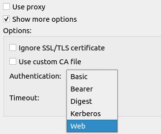
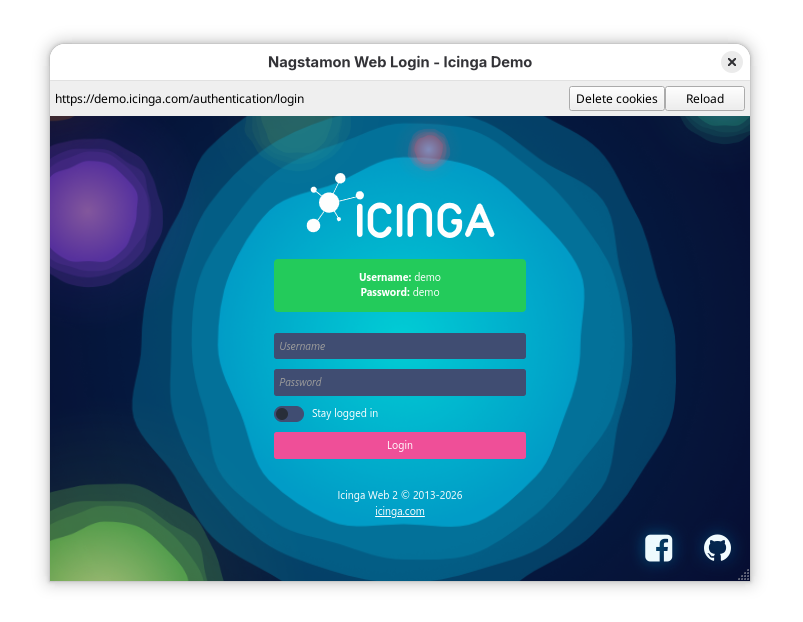

Thanks to the work of the [contributor community](https://github.com/HenriWahl/Nagstamon/graphs/contributors?from=24.2.2024) it is finally time to release another
stable release of Nagstamon - **3.18.0**.

The main improvement is the support for **web login** via session cookies. This feature is
still not fully mature but deploying it to a broader audience might help to improve it
further.

Activate it in the server settings:

If no cookies are available yet, a small **browser login window** will pop up:

A new server type is available now: **LibreNMS**.

All changes at a glance:

- added experimental web login via cookies
- added LibreNMS support
- improved Alertmanager support for multiple alerts
- improved Centreon token validation
- improved Zabbix support in contect menu
- improved macOS support
- fixed sound files
- fixes for Checkmk
- fixes for Alertmanager
- fixes for IcingaDBWeb
- fixes for IcingaWeb2
- fixes for Zabbix
- updated Qt6
- code cleanup

As always get your copy of Nagstamon 3.18.0 at [https://nagstamon.de/download](https://nagstamon.de/download)

Contributions are welcome at [https://github.com/HenriWahl/Nagstamon](https://github.com/HenriWahl/Nagstamon) as well as
donations at [https://www.paypal.com/paypalme/nagstamon](https://www.paypal.com/paypalme/nagstamon).
